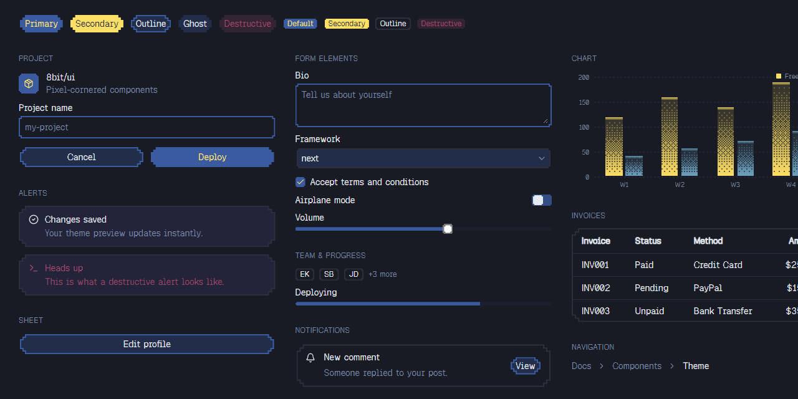
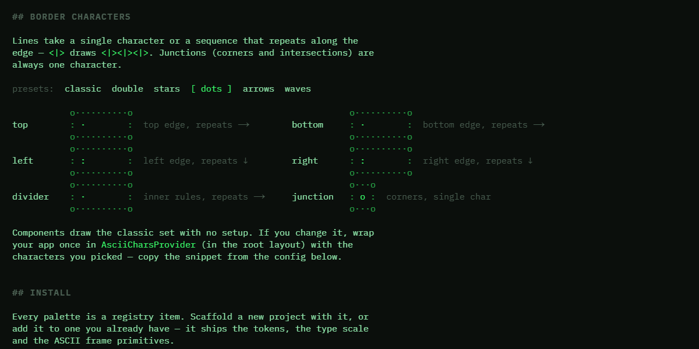

# cnlibs.com

cnlibs is a collection of ui libraries based on shadcn/ui.

## Libraries

|  |  |
| :---: | :---: |
| [8bit.cnlibs.com](https://8bit.cnlibs.com) | [ascii.cnlibs.com](https://ascii.cnlibs.com) |

## License

MIT